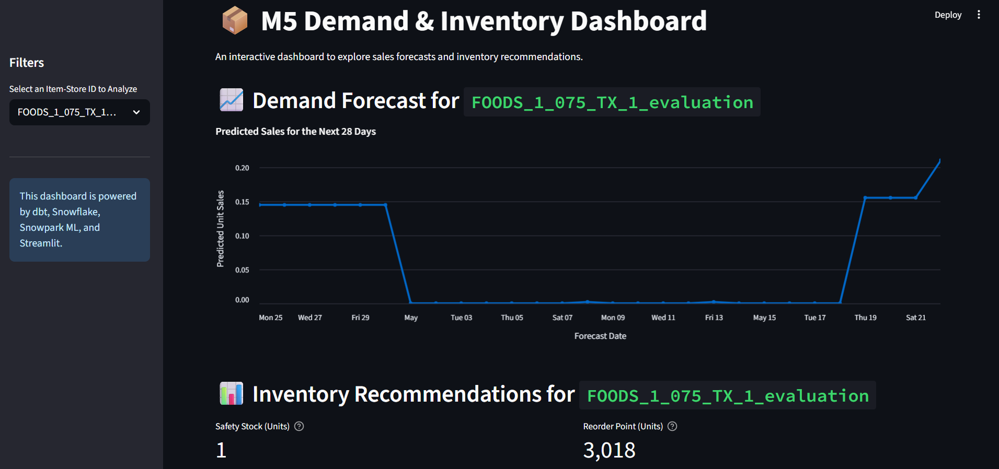
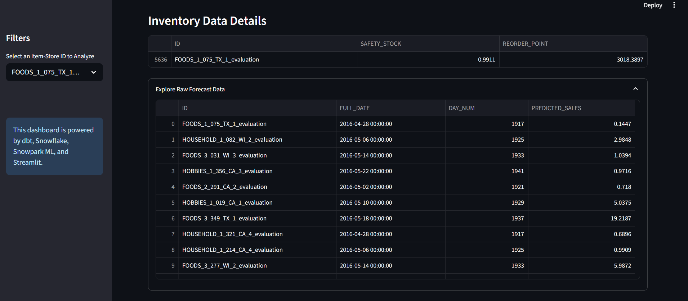

# M5 Demand Forecasting and Inventory Optimization Pipeline

[](https://github.com/RuffinaMercy/Supply-chain-project/actions/workflows/.ci.yml)

This project demonstrates a complete, end-to-end pipeline for forecasting retail sales demand using the M5 competition dataset and calculating inventory control parameters. The entire pipeline is built using a modern data stack: **dbt, Snowflake, Snowpark, MLflow, and Streamlit.**

## 📊 Dashboard Preview

*(**Instructions:** After running the project, take a screenshot of your Streamlit dashboard. Create an `images` folder in your project root, save the screenshot as `dashboard_preview.png` inside it, and then uncomment the line below to display it.)*




---

## 🚀 Project Overview

The goal is to predict the next 28 days of unit sales for thousands of products sold at Walmart stores in the USA. Based on these forecasts, we then calculate essential inventory metrics like **Safety Stock** and **Reorder Point** to help optimize stock levels, reduce stockouts, and manage holding costs.

### Tech Stack
- **Data Warehouse:** Snowflake
- **Data Transformation:** dbt (Data Build Tool)
- **ML & Processing:** Snowpark for Python & Snowpark ML
- **ML Experiment Tracking:** MLflow
- **Dashboarding:** Streamlit

### ✨ Key Features & Accomplishments
- **End-to-End Automation:** Built a complete pipeline from raw data transformation to ML model training and final business recommendations.
- **Scalable Feature Engineering:** Used dbt to create a robust and reproducible feature store with complex time-series features.
- **In-Database Machine Learning:** Leveraged Snowpark ML to train an XGBoost model on millions of rows without moving data out of Snowflake, ensuring security and performance.
- **Inventory Control Logic:** Translated business requirements (lead time, service level) into actionable inventory parameters (Safety Stock, Reorder Point).
- **Interactive Visualization:** Developed a user-friendly Streamlit dashboard for non-technical stakeholders to explore the results.
- **Secure Credential Management:** Ensured Snowflake credentials are kept secure and are not committed to the repository by using a `.gitignore` and a template configuration file.

---

## 🛠️ How to Run This Project

### Prerequisites
- Python 3.9+
- A Snowflake account with appropriate permissions.
- An active Python virtual environment.

### 1. Setup & Configuration

**Clone the repository and install the required packages:**
```bash
git clone https://github.com/RuffinaMercy/Supply-chain-project.git
cd Supply-chain-project
python -m venv .venv

# On Windows
.\.venv\Scripts\activate

# On macOS/Linux
# source .venv/bin/activate

pip install -r requirements.txt