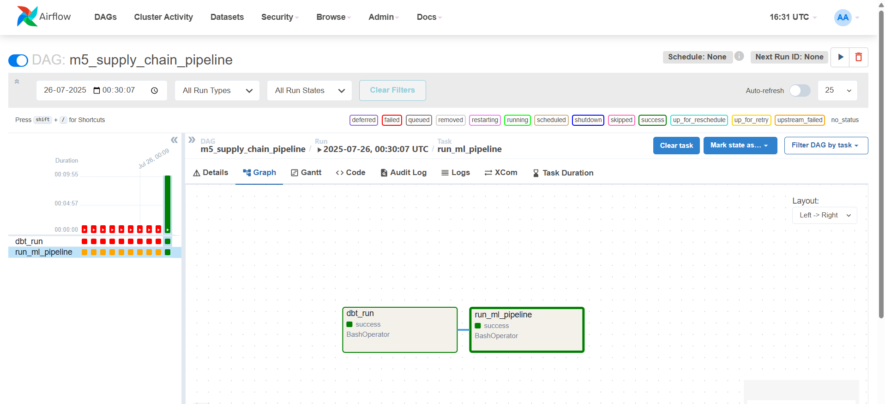

# M5 End-to-End Supply Chain Pipeline: Forecasting & Inventory Optimization

**🚀 Live Dashboard:** [**https://supply-chain-project-ix3ugsatkhqkmcu6qwhwpw.streamlit.app/**](https://supply-chain-project-ix3ugsatkhqkmcu6qwhwpw.streamlit.app/)

[![DBT CI Pipeline]]([](https://github.com/RuffinaMercy/Supply-chain-project/actions/workflows/.ci.yml))

This repository contains a complete, end-to-end pipeline for forecasting retail sales demand using the M5 competition dataset. It leverages a modern data stack to transform raw data, train a machine learning model, and serve the results in an interactive dashboard.

## 📊 Dashboard Preview
The final output is an interactive Streamlit dashboard that allows business users to explore the 28-day sales forecast and inventory recommendations for any product-store combination.


---

## ✨ Key Features & Accomplishments

- **End-to-End Automation:** Built a full pipeline from raw data to a deployed user interface, orchestrated with Apache Airflow.
- **Scalable Data Transformation:** Used dbt and Snowflake to efficiently transform and engineer features for over 58 million rows of sales data.
- **In-Database Machine Learning:** Leveraged Snowpark ML to train an XGBoost model directly in Snowflake, ensuring data security and performance without data movement.
- **MLOps Best Practices:**
  - **Orchestration:** Automated the entire backend pipeline with an Airflow DAG.
  - **Experiment Tracking:** Integrated MLflow to log model parameters for reproducibility.
  - **CI/CD:** Implemented a GitHub Actions workflow to automatically run data quality tests (`dbt test`) on every push.
- **Actionable Business Insights:** The pipeline doesn't just predict; it calculates crucial inventory metrics like **Safety Stock** and **Reorder Point**.

---

## ⚙️ Project Architecture & Workflow

The project is built on a modern data application stack, separating transformation, machine learning, and presentation layers.

1.  **Data Transformation (dbt):** A dbt project connects to Snowflake to clean, unpivot, join, and create time-series features (lags, rolling averages) from the raw M5 data.
2.  **ML Pipeline (Snowpark ML):** A Python script reads the dbt-prepared feature table, samples the data to manage scale, trains an XGBoost model, and saves the forecasts and inventory calculations back to Snowflake.
3.  **Orchestration (Apache Airflow):** The entire backend (`dbt run` -> `python ml_pipeline.py`) is defined as a DAG and runs inside a custom Docker environment, ensuring all dependencies are managed.
    
4.  **Experiment Tracking (MLflow):** Key parameters from the ML pipeline are logged to MLflow, providing a clear record of each training run.


---

## 🛠️ How to Run This Project Locally

### Prerequisites
- Python 3.11+
- A Snowflake account with appropriate permissions.
- Docker Desktop (for running the Airflow pipeline).
- An active Python virtual environment.

### 1. Setup & Configuration

**Clone the repository and install the required packages:**
```bash
git clone https://github.com/RuffinaMercy/Supply-chain-project.git
cd Supply-chain-project
python -m venv .venv

# On Windows
.\.venv\Scripts\activate

# On macOS/Linux
# source .venv/bin/activate

pip install -r requirements.txt


Configure Snowflake Connections:

For dbt (in Airflow): Create an .env file from the .env.example and fill in your Snowflake credentials. This will be used by the Airflow DAG.

For the ML Pipeline: Create a config.toml file from config.toml.example and fill in your credentials. This is used when running the script manually.

For Streamlit Deployment: Add your credentials to the Streamlit Cloud secrets management.

2. Running the Full Pipeline with Airflow

Step 1: Start Airflow
First, start all the Airflow services in the background.

Generated bash
docker compose up -d

Access the Airflow UI at http://localhost:8080 (login: airflow/airflow).

Step 2: Trigger the DAG
In the Airflow UI, find the m5_supply_chain_pipeline DAG, un-pause it, and click the "play" button to trigger a run.

3. Viewing the Dashboard

Once the Airflow pipeline has completed successfully, you can view the results.

Generated bash
# In a separate terminal, start the MLflow UI (optional)
mlflow ui

# In your main terminal, start the dashboard
streamlit run dashboard_app.py

📂 Project Structure

project_main/: The dbt project for all SQL transformations.

dags/: Contains the Airflow DAG definition file.

images/: Stores screenshots for the README.

ml_pipeline.py: The main Python script for the Snowpark ML pipeline.

dashboard_app.py: The Streamlit dashboard application.

Dockerfile & docker-compose.yaml: Configuration for the Airflow environment.

